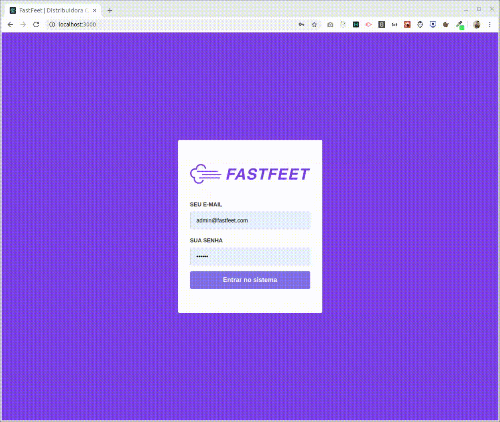

<p align="center">

</p>

<h1 align="center">FastFeet Web Application from Rocketseat GoStack</h1>

<blockquote align="center">
:zap: ReactJS application to obtain the GoStack bootcamp certify
</blockquote>

<p align="center">
  

  <a href="https://leunardo.dev">
    
  </a>
</p>

<p align="center">

</p>

## Introduction

[Fastfeet](https://github.com/LeuAlmeida/fastfeet-web) is a fictitious logistic company and this repository belong to the business logic and is the basis of a general structure and all of this be a part of the [Rocketseat bootcamp](https://github.com/rocketseat) certify.
This application is based on the [Fastfeet API](https://github.com/LeuAlmeida/fastfeet.api) previously developed.

## :electric_plug: Prerequisites

- [Node.js LTS (>= 10.x)](https://nodejs.org/)
- [Yarn (>= 1.21)](https://yarnpkg.com/) or [NPM (>= 6.9)](https://www.npmjs.com/)

### :closed_lock_with_key: Getting started the application

Make a clone from the repo and install the dependencies

```shell
# First of all, clone the project
$ git clone https://github.com/LeuAlmeida/fastfeet-web.git

# Enter in the DevRadar folder
$ cd fastfeet-web

# Install all dependencies using Yarn
$ yarn

# Run the project
$ yarn start
```

## Demo

Live demo incoming.

<!-- You can try a DevRadar online demo in [https://1dois.com.br/devradar](https://1dois.com.br/devradar) (without navigator current location) -->

## :heavy_check_mark: Stack

| Dependencies          | Dev Dependencies            |
| --------------------  | :-------------------------: |
| Unform                |         Babel-ESLint        |
| Axios                 |           ESLint            |
| Date-fns              |         Customize-CRA       |
| History               |          Prettier           |
| Immer                 |       React-App-Rewired     |
| Polished              |            Youch            |
| Prop-Types            |                             |
| React-Icons           |                             |
| React-Input-Mask      |                             |
| React-Redux           |                             |
| React-Router-Dom      |                             |
| React-Select          |                             |
| React-Toastify        |                             |
| Reactjs-Popup         |                             |
| Reactotron-React-Js   |                             |
| Reactotron-Redux      |                             |
| Reactotron-Redux-Saga |                             |
| Redux                 |                             |
| Redux-Persist         |                             |
| Redux-Saga            |                             |
| Styled-Components     |                             |
| Yup                   |                             |

## :copyright: License

MIT License.

See [LICENSE](LICENSE) for details.

<hr/>

<h3 align="center">
<a href="http://linkedin.com/in/leonardoalmeida99">Connect me in LinkedIn</a> | <a href="http://behance.net/almeida99">See my Behance</a> | <a href="https://leunardo.dev">Click here to go to my CV</a>
</h3>
